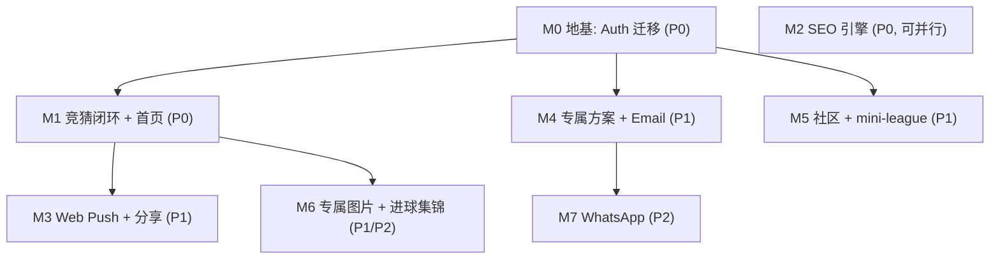

# Skorly 二期方案（会员 · 预测 · 增长）

> 本文档是 Skorly 网站**二期**的规划与任务追踪。一期已交付：AI 多语言内容资讯站 + WC2026 数据 ingest + 自动化生成/QA 流水线 + Cloudflare 部署。二期目标：把"纯阅读"升级为"会员 + 竞猜 + 社区 + 增长引擎"。
>
> 同步维护的 Cursor 计划文件（带可勾选 todo）：`.cursor/plans/skorly_会员与预测功能_2e693864.plan.md`。

## 选定方向（已与产品确认）

- 预测方案：**组合式**——免费 AI 预测文章引流 → 注册解锁专属深度方案 → 竞猜赢奖留存。
- 账号：**完整 Supabase Auth**（邮箱注册/登录 + Google/Facebook + 邮箱验证 + 找回密码）。
- 推送渠道：**Email 先行（Resend），WhatsApp 紧随**。
- 预测来源：**纯 AI 生成 + 统计锚定**（Elo/泊松），不接第三方竞猜方案，不显示赔率盘口。
- 图片风险姿态：**激进档**——允许 AI 生成可辨识球星海报用于营销，已知情接受尾部风险。
- 社区：评论（文章 + 方案）+ 结构化「晒预测」，**不做开放论坛**。

## 关键架构决策

- **采用 Supabase Auth** 替换自建认证。`auth.users` 负责密码/OAuth/邮箱验证/找回密码；现有 `packages/db/src/schema.ts` 的 `users` 表改造为 `profiles`（主键 uuid = `auth.users.id`），废弃 `accounts/sessions/verificationTokens/passwordHash`。
- **外键迁移**：`predictions / comments / commentLikes / commentReports / campaignEntries / winners` 的 `userId` 由 `integer` 改为 `uuid` 引用 `profiles.id`。当前无真实用户，迁移低风险，须尽早做。
- **合规护栏**（贯穿全程）：预测定位为"趣味竞猜/编辑分析"，**不显示赔率盘口、不接博彩导流**；进球集锦**只嵌入官方/授权视频源，绝不自托管**。

## 里程碑与优先级

优先级：**P0 = 世界杯开赛前/赛初必上**；**P1 = 赛中尽快补齐**；**P2 = 赛中后段或赛后**。
两条 track 可并行：**会员 track（M0→M1→M3/M4/M5）** 与 **SEO track（M2）** 无强依赖。

### M0 — 地基：Auth 迁移（P0，阻塞大多数会员功能）
- 接入 `@supabase/ssr`：`apps/web/lib/supabase/{server,client,middleware}.ts`，更新 `apps/web/middleware.ts`（与 next-intl 组合做 session 刷新）。
- schema：`users` → `profiles`（uuid 主键 + displayName/avatar/whatsapp/locale/consent），Drizzle migration + Supabase 应用；迁移上述各表外键类型。
- Auth UI（i18n id/vi/en）：`[locale]/daftar`（注册）、`[locale]/masuk`（登录）、`[locale]/akun`（个人中心）、`/auth/callback`、找回密码页。Resend 作为 Supabase 自定义 SMTP。注册接 Turnstile + Upstash 限流。
- **完成判据**：注册/登录/Google·Facebook/邮箱验证/找回密码全可用；外键迁移完成；typecheck/build 通过。

### M1 — 竞猜留存闭环 + 首页（P0，核心差异化 + 拉新钩子）
- 猜比分组件（登录可用）→ 写 `predictions`；赛后打分 cron（`apps/jobs/src/index.ts`，按 `fixtures.home/awayGoals` 算 `pointsAwarded`）。
- 排行榜页 `[locale]/peringkat` + 个人主页"我的命中率/历史" + 1 个世界杯竞猜活动（`campaigns/winners`）。
- 淘汰赛 Bracket 预测挑战（填晋级图 + 可分享图）。
- 预测统计模型（Elo/泊松期望进球，特征取自 API-Football）给预测背书。
- 首页改版 `apps/web/app/[locale]/page.tsx`：前置临近比赛 + 一键猜比分、专属方案 teaser、登录用户个性化、倒计时缩小。
- **完成判据**：登录用户能猜比分、看排行榜与个人命中率、填 bracket；首页前置竞猜与个性化。

### M2 — SEO 流量引擎（P0，最大获客，独立于账号，建议并行）
- 实时文字比分 + 赛果页（复用 `fixtures/fixtureEvents`，赛中分钟级事件）。
- 程序化 SEO 批量页（X vs Y 预测 / H2H / 积分榜 / 赛程 / 球员，× id·vi·en 三语 + 结构化数据 + ISR）。
- Google News 收录 + Discover + Web Stories + 扩展 `apps/web/components/json-ld.tsx`（SportsEvent/FAQ/Breadcrumb）。
- 合法「在哪看」页（P1，导向官方转播，不碰盗播）。
- **完成判据**：比分/赛果/积分榜页上线；程序化页三语生成；进入 Google News，结构化数据校验通过。

### M3 — 留存与分享放大（P1，依赖 M1）
- PWA + Web Push 通知（开赛/进球/你的预测结果）。
- 预测/排行榜一键分享 + 轻量 OG 分享图（先用 `@vercel/og`，艺术海报走 M6）。
- **完成判据**：用户可订阅 push 并收到通知；预测与排行榜可一键分享。

### M4 — 专属方案 + Email（P1，依赖 M0）
- 内容分层：免费预览 + 登录解锁专属方案（复用 ai-content 包加 premium prompt）。
- 重写 `apps/web/app/api/subscribe/route.ts`（落库 `subscribers` + 双重确认 + Turnstile + 限流）+ Resend 模板 + 赛前定向推送 cron。
- **完成判据**：订阅双重确认走通；专属方案对登录用户解锁并能赛前定向发邮件。

### M5 — 社区 + 网络效应（P1，依赖 M0 + 内容）
- 评论系统（表已存在）：挂 `comments.articleId`，同时覆盖文章与方案；点赞 + 1 级回复 + 举报；Turnstile + 限流 + **反盗链/反博彩过滤**；举报进 `commentReports` 走 `isHidden`。
- 结构化「晒预测」（绑定 `fixtureId`，复用 `predictions`）。
- 私人竞猜联赛 mini-league（建群邀请好友，复用 `campaignType=referral` + `campaignEntries`）。
- **完成判据**：登录可评论/点赞/举报；可建私人联赛并邀请好友。

### M6 — 专属图片 + 进球集锦（P1/P2）
- 球队身份注册表（每队：别名、图腾动物、主/辅配色、国旗、当家球星 + 球衣号码）→ 参数化 GPT-Image prompt。
- 海报模板：球星主视觉（激进档）/ 图腾对决 / 动作剪影；加 Skorly 水印 → R2 或 Supabase Storage → `imageLibrary` 表；fixture 生命周期 cron 自动触发。
- 低成本护栏：不伪造代言、不放官方队徽与赞助商 logo、备好 takedown 响应流程。
- 进球集锦：`fixtureEvents` 文字时间线 + `articles.embeds` 仅嵌入官方/授权源（复用 `social-embed.tsx`）。
- **完成判据**：赛前海报/赛后比分卡自动生成并用于文章/分享/邮件；recap 页有进球时间线 + 官方嵌入。

### M7 — 多渠道扩展（P2，后置，依赖 M4）
- WhatsApp Business API（Meta Cloud API 或 Twilio），复用 `subscribers.whatsappNumber`，扩展专属方案/图片为模板消息（需模板审核）。
- **完成判据**：专属方案/图片可经 WhatsApp 模板消息推送。

## 环境变量待补

- `SUPABASE_URL / SUPABASE_ANON_KEY / SUPABASE_SERVICE_ROLE_KEY`（`env.example` 已有占位）。
- Cloudflare Turnstile site/secret key（注册 + 订阅防刷）。
- GPT-Image API key（M6）。
- WhatsApp Business API 凭证（M7）。

## 风险与注意

- 印尼博彩执法极严：严守"无赔率、无博彩导流"定位。
- 进球集锦版权红线：仅官方授权嵌入，无自托管。
- Auth 迁移涉及多表外键类型变更，须在无真实用户阶段尽早做。
- **球星肖像（激进档，已知情接受）**：AI 生成可辨识球星形象用于营销，存在肖像权/形象权的**非对称尾部风险**——做大后可能遭 cease-and-desist / 广告联盟封号 / 支付通道冻结 / 应用商店下架；世界杯期间 FIFA + 球员工会维权尤为激进。已采用低成本缓解；如需降险可随时切回"图腾对决/动作剪影"安全模板。

## 时间提醒

世界杯开赛在即，**P0（M0 + M1 + M2）已是不小的工作量**。建议把 P0 锁成"开赛前最小可用集"，P1/P2 赛中滚动上线。若时间不够，**M0 + M2 优先**（账号地基 + SEO 获客），M1 紧随。
